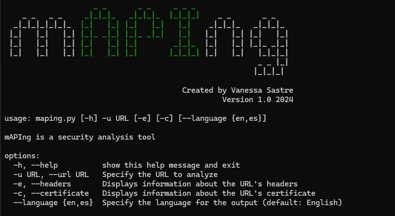
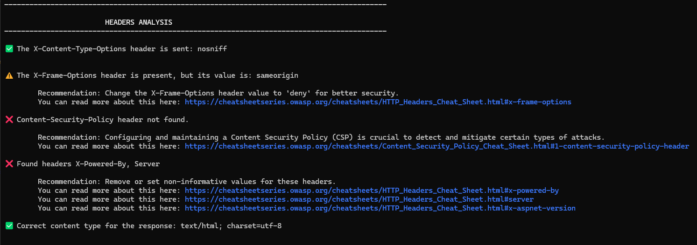
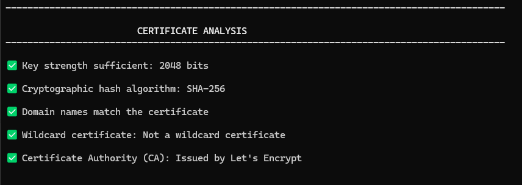

<p>
  
</p>

mAPIng is a command-line interface (CLI) tool designed to evaluate the security of web applications.

Its interface allows users to request complete or specific analyses using flags.

It focuses on two main areas of checking: headers and transport layer security certificates.

## Main Features

#### Analysis of HTTP Headers:

- X-Content-Type-Options
- X-Frame-Options
- Content-Security-Policy
- Fingerprinting
- Content-Type

#### Evaluation of SSL/TLS Certificates:

- Key Strength
- Hashing Algorithm
- Domain names
- Wildcard Certificates
- Certificate Authority

## Installation

1. Clone this repository to your local machine.
2. Ensure you have Python 3 installed on your system.
3. Install the dependencies using pip:

```
pip install -r requirements.txt
```

## Usage

```
python maping.py -u <URL> [-e] [-c] [--language <lang>]
```

- `-u, --url`: Specifies the URL you want to analyze.
- `-e, --headers`: Displays detailed information about the HTTP headers of the URL (optional).
- `-c, --certificate`: Displays detailed information about the SSL certificate of the URL (optional).
- `--language <lang>`: Specifies the language for the output. Default is en for English. Use `--language es` to switch to Spanish.


### Usage Example

By default, both header and certificate analyses are executed. If you want to run only one of them, you can use the corresponding flag.

Example usage to perform both header and certificate analyses:

```
python maping.py -u https://example.com
```

Example usage to perform only header analysis:

```
python maping.py -u https://example.com -e
```

Example usage to perform only certificate analysis:

```
python maping.py -u https://example.com -c
```

## Output Examples

#### Help menu



#### Header analysis with detected issues



#### Certificate analysis with no issues found



## Credits

Created by Vanessa Sastre.

## License

This project is licensed under the [Attribution-NonCommercial-ShareAlike 3.0 Spain License by Creative Commons](LICENSE).

[](https://sonarcloud.io/summary/new_code?id=vanessastre_maping-cli-security-tool)
[](https://sonarcloud.io/summary/new_code?id=vanessastre_maping-cli-security-tool)
[](https://sonarcloud.io/summary/new_code?id=vanessastre_maping-cli-security-tool)
